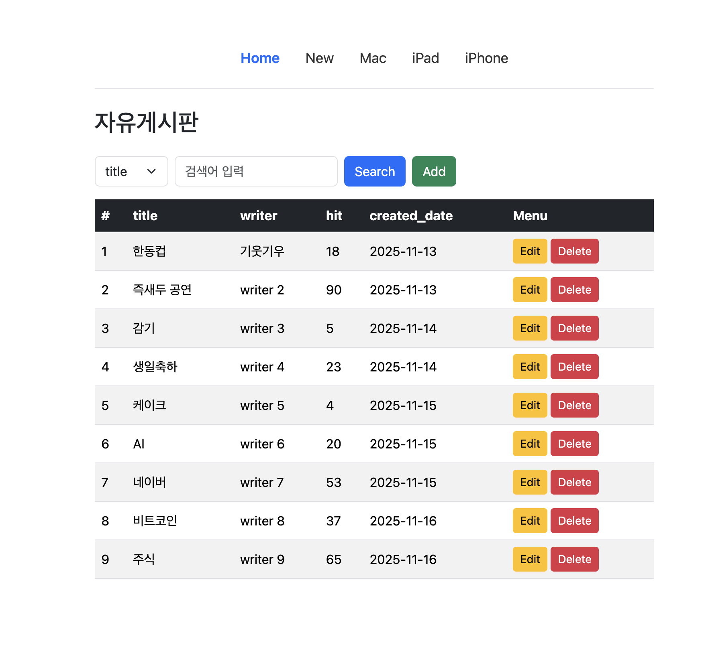
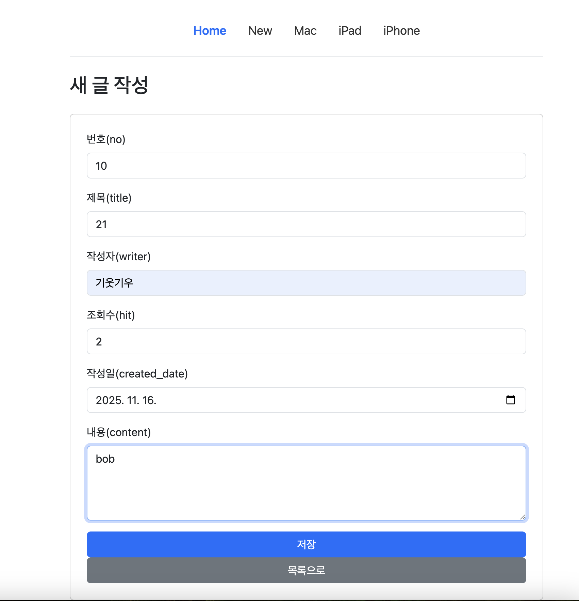
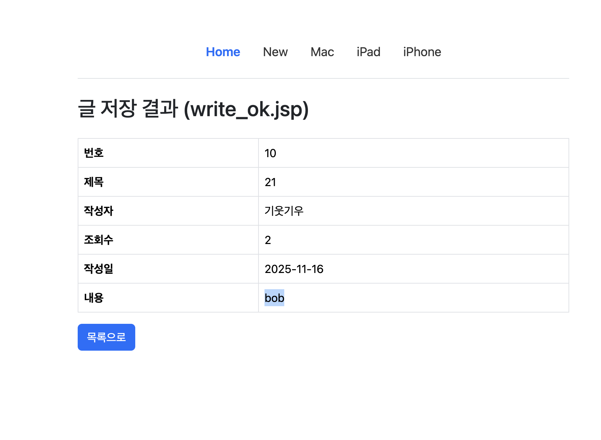
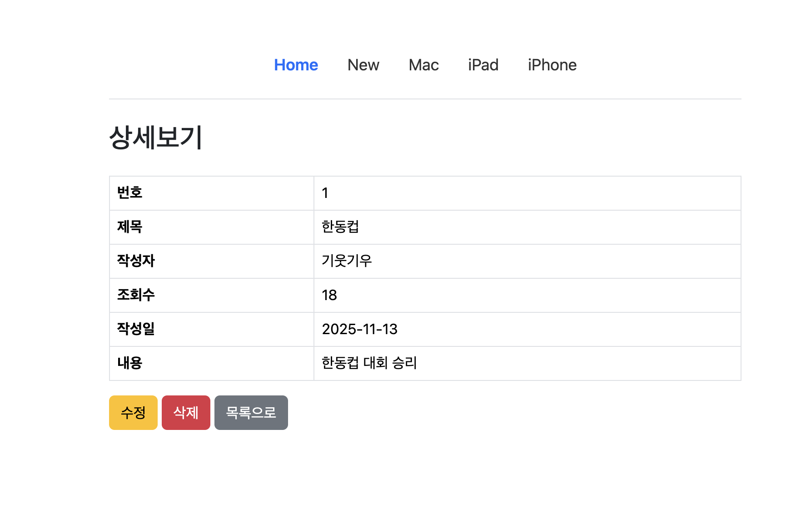
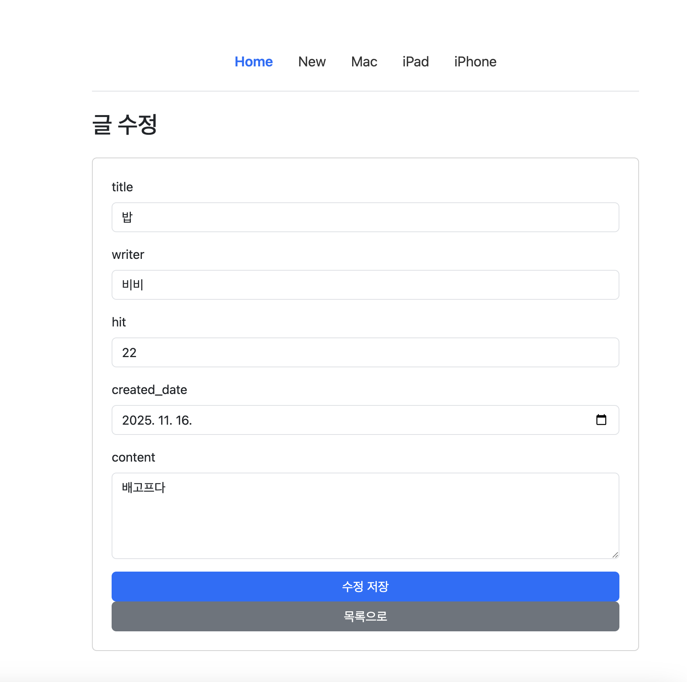
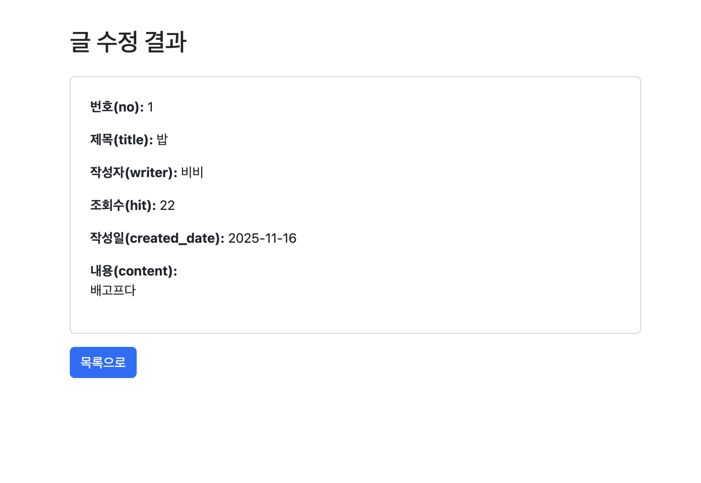
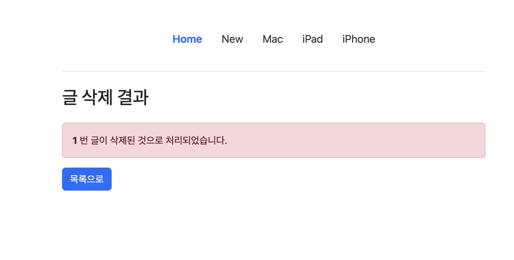
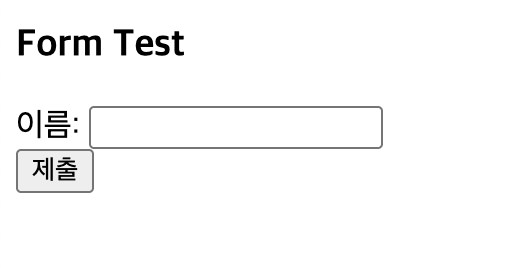
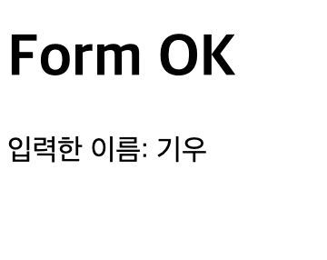

# 📌 JSP Project 2-1
**GitHub → Railway 배포 & CRUD 기능 테스트 페이지**

---

## 📸 1. CRUD 기능 실행 결과

아래는 JSP Project에서 구현한 주요 기능들의 실제 실행 화면입니다.  
`captures/` 폴더에 저장된 이미지를 기반으로 구성했습니다.

---

### ✅ 1) 전체 목록 조회 (list.jsp)

---

### ✍️ 2) 글쓰기 (write.html)

---

### ✍️ 2-1) 글쓰기 성공 (write_ok.jsp)

---

### 🔍 3) 상세 보기 (view.jsp)

---

### 📝 4) 수정 페이지 (edit.html)

---

### 📝 4-1) 수정 완료 (edit_ok.jsp)

---

### ❌ 5) 삭제 완료 (delete_ok.jsp)

---

## 🧪 6. Form Test 실행 결과

### 📄 form.html

---

### 📄 form_ok.jsp

---

